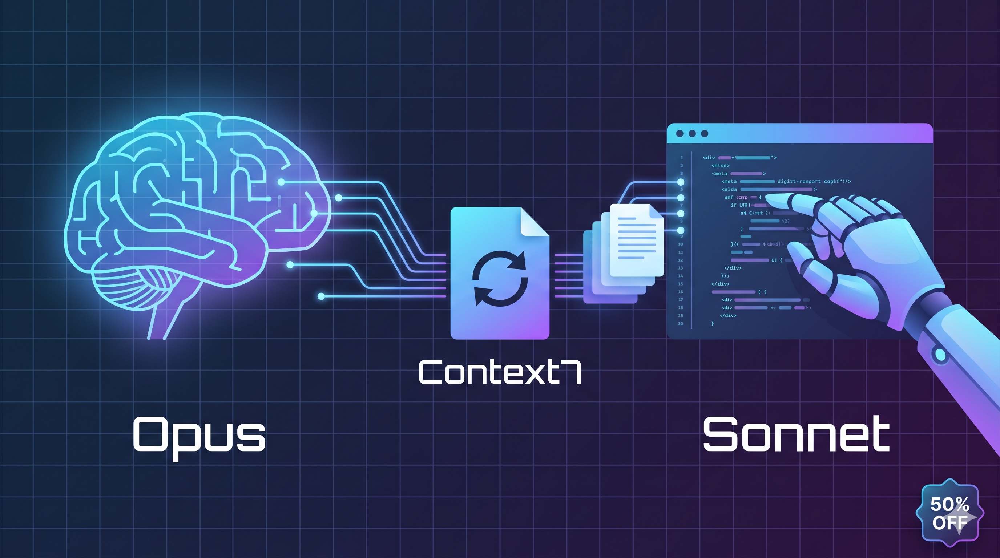

# Claude Code Tips



Practical guides for optimizing Claude Code usage — save tokens, reduce costs, and keep code quality high.

## Articles

- [How to Cut Claude Code Costs in Half — Without Losing Quality](how-to-cut-claude-code-costs-in-half.md) (English)
- [Як скоротити витрати на Claude Code вдвічі — без втрати якості](how-to-cut-claude-code-costs-in-half-uk.md) (Українська)

## Key Takeaway

The right combination of **Opus 4.6** (architect) + **Context7** (docs) + **Sonnet 4.6** (executor) delivers the same code quality at **half the price** compared to pure Opus 4.7.

**Step 1.** Set Opus 4.6 as the main model in `~/.claude/settings.json`:

```json
{
  "model": "claude-opus-4-6",
  "enableAllProjectMcpServers": true
}
```

**Step 2.** Create a Sonnet subagent in `~/.claude/agents/code-writer.md`:

```markdown
---
name: code-writer
description: Writes code based on clear specifications
model: sonnet
tools: Read, Edit, Write, Bash
---

You are a focused code-writing agent. Implement exactly what's described in the task, following existing patterns in the codebase. Do not plan or discuss architecture — just write the code.
```

**Step 3.** Add Context7 for up-to-date docs. Create `.mcp.json` in your project root:

```json
{
  "mcpServers": {
    "context7": {
      "command": "npx",
      "args": ["-y", "@upstash/context7-mcp@latest"]
    }
  }
}
```

Opus thinks, Context7 provides current docs, Sonnet writes — save 41-48% on your Claude Code bills.

## License

This content is open source. Use it, share it, improve it.
